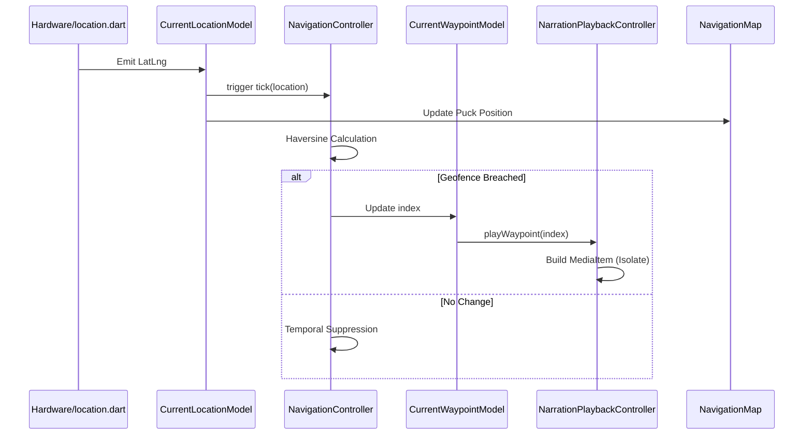
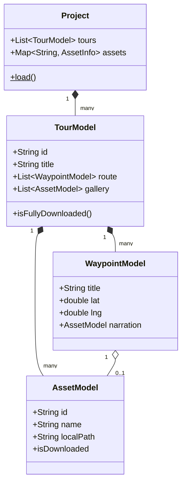
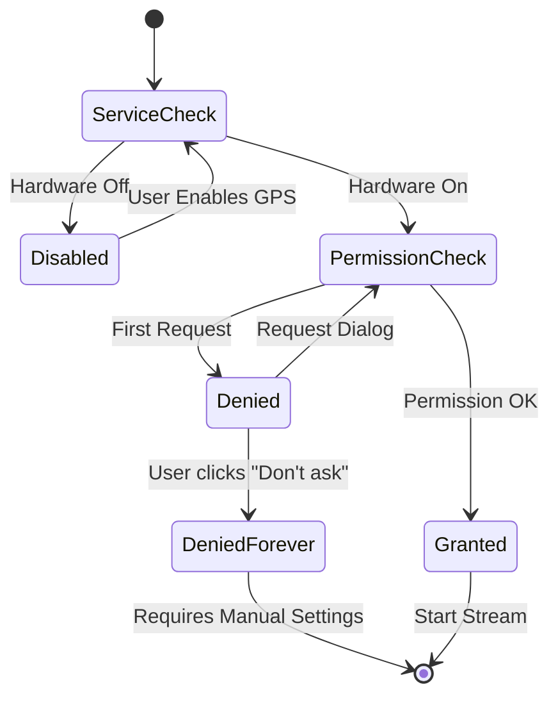

# TourForge Baseline Engine: Technical Specification

TourForge Baseline is a white-label Flutter library providing a high-performance, offline-first spatial engine. This document serves as the formal technical mapping of the codebase, detailing the responsibilities of every module and their inter-dependencies within the ecosystem.

---

## 1. System Architecture & Component Mapping

The engine is structured as a **Reactive Producer**. It encapsulates complex native integrations (Mapping, Audio, GPS) and exposes them through a declarative configuration interface.

### 1.1 Core Bootstrap & Configuration
*   **`lib/tourforge.dart`**: The library entry point. Orchestrates the global initialization sequence:
    1.  Binds `WidgetsFlutterBinding`.
    2.  Resolves the `baseUrl` (potentially via indirect HTTP fetch).
    3.  Initializes `DownloadManager` and `NarrationPlaybackController`.
    4.  Triggers the `Project.load()` sequence.
*   **`lib/src/config.dart`**: Defines `TourForgeConfig`, the primary dependency injection (DI) container. This singleton holds all branding, theming, and endpoint data provided by the consumer app.

### 1.2 Data Modeling & Serialization (`lib/src/data.dart`)
This module implements the **Immutable Project Tree**. It is the single source of truth for the application state.
*   **`Project`**: The root aggregate. Handles the atomic loading of the `tourforge.json` manifest.
*   **`TourModel`**: Encapsulates a route. Handles **Google Encoded Polyline** decoding for spatial paths.
*   **`AssetModel`**: Implements **Content-Addressable Storage (CAS)**. Assets are indexed by their SHA-hashes rather than names, enabling cross-tour deduplication and integrity verification.
*   **`WaypointModel` / `PoiModel`**: Domain entities for geographic points of interest.

### 1.3 The Spatial Subsystem
*   **`lib/src/controllers/navigation.dart`**: The Geofencing Engine. Implements the **Haversine Formula** for great-circle distance calculations. It performs O(n) proximity checks per GPS tick to resolve the current active waypoint.
*   **`lib/src/math.dart`**: Provides spherical trigonometry utilities. Specifically, it handles the conversion of Lat/Lng coordinates to 3D Cartesian vectors (`Vec3`) to calculate the true geographic centroid of a route.
*   **`lib/src/location.dart`**: Manages the **GPS Permission State Machine**. It wraps the `geolocator` plugin to handle platform-specific transitions between permission states (Denied, Granted, ServiceDisabled).

### 1.4 The Mapping Infrastructure
*   **`lib/src/screens/navigation/maplibre_map.dart`**: The Native Bridge. Utilizes Platform Views (`AndroidView`/`UiKitView`) to host MapLibre GL. It manages a complex **Style Orchestration Pipeline**:
    1.  Extracts compressed assets (fonts, sprites) from the Flutter bundle to local storage.
    2.  Rewrites Style JSON to use `file://` and `mbtiles://` URIs for offline tile serving.
*   **`lib/src/screens/navigation/map.dart`**: A compositional wrapper that layers Flutter widgets (User Puck, POI Markers) over the native MapLibre surface.

### 1.5 Media & Narration Subsystem
*   **`lib/src/controllers/narration_playback.dart`**: Implements `BaseAudioHandler` from `audio_service`. It ensures Dart execution remains active in a persistent background process. It leverages `just_audio` to interface with native hardware decoders.
*   **`lib/src/asset_image.dart`**: A custom `ImageProvider`. It intercepts the image resolution pipeline to verify asset presence via `DownloadManager` before rendering, preventing broken UI states.

### 1.6 Storage & Synchronization
*   **`lib/src/download_manager.dart`**: A robust I/O engine. It implements **Atomic File Swapping** (via `.part` files) and **Randomized Exponential Backoff** for network resiliency. It deduplicates concurrent requests for the same content-addressable ID.
*   **`lib/src/asset_garbage_collector.dart`**: Implements a **Mark-and-Sweep GC** for the file system. It sweeps the local storage directory and purges any file whose hash is no longer referenced in the active `Project` index.
*   **`lib/src/help_viewed.dart`**: A lightweight persistence layer using zero-byte files as boolean flags for onboarding state.

---

## 2. Inter-Component Data Flow

### 2.1 The "GPS Tick" Lifecycle

1.  **`location.dart`** emits a new `LatLng` coordinate.
2.  **`CurrentLocationModel`** (reactive model) is updated.
3.  **`NavigationController`** (`navigation.dart`) receives the tick and evaluates it against the `TourModel` waypoints.
4.  If a geofence is breached, **`CurrentWaypointModel`** is updated with the new index.
5.  **`NarrationPlaybackController`** (`narration_playback.dart`) listens for index changes and initiates audio playback.
6.  **`NavigationMap`** (`map.dart`) pans the camera if `MapControllednessModel` is enabled.

### 2.2 The Asset Sync Lifecycle
1.  **`Project.load()`** identifies required assets in the `TourModel`.
2.  **`TourDetails`** calls `DownloadManager.downloadAll()`.
3.  **`DownloadManager`** checks for file existence via the CAS hash.
4.  If missing, it streams data to a `.part` file and atomically renames it upon completion.
5.  **`AssetImage`** and **`NarrationPlaybackController`** now have safe, local `file://` access to the content.

### 2.3 Core Model Relationships (Class Diagram)

### 2.4 GPS Permission Lifecycle (State Diagram)

---

## 3. Performance & Threading Model

*   **Main UI Thread**: Handles widget tree composition and user input.
*   **Native Main Thread**: Handles MapLibre GL rendering and Audio decoding.
*   **Dart Isolates (`compute`)**: `NarrationPlaybackController` spawns background isolates to decode and crop JPEG thumbnails, preventing UI jank during media metadata updates.
*   **Background Service**: `audio_service` keeps a minimal Dart runtime alive even when the app is backgrounded or the screen is locked.

---

## 4. Source Code File Responsibility Matrix

| File | Primary Responsibility | Key Relationship |
| :--- | :--- | :--- |
| `tourforge.dart` | Engine Bootstrap | Entry point for consumer apps |
| `config.dart` | White-Label Configuration | Global DI container |
| `data.dart` | Immutable Models & CAS | Project State / Asset IDs |
| `download_manager.dart` | Atomic File I/O | Persistence Layer |
| `navigation.dart` | Geofencing Engine | GPS -> State mapping |
| `maplibre_map.dart` | Native Map Integration | Style & Tile Orchestration |
| `narration_playback.dart` | Background Audio | Media Session Bridge |
| `asset_garbage_collector.dart` | Storage Cleanup | Sweep unreferenced hashes |
| `math.dart` | Spherical Trigonometry | Route Centroids |
| `location.dart` | Permission State Machine | Hardware GPS Access |
| `asset_image.dart` | Async Image Resolution | File-backed `ImageProvider` |
| `home.dart` | Catalog Entry Point | `Project` -> UI mapping |
| `tour_details.dart` | Asset Gatekeeper | Sync Verification |

---

## 5. Technical Standards
*   **SDK:** Dart ^3.6.0, Flutter >=3.27.0
*   **Coordinate System:** WGS 84 (EPSG:4326)
*   **Spatial Indexing:** O(n) Linear Search (optimized via temporal suppression)
*   **Asset Addressing:** SHA-based Content-Addressable Storage
